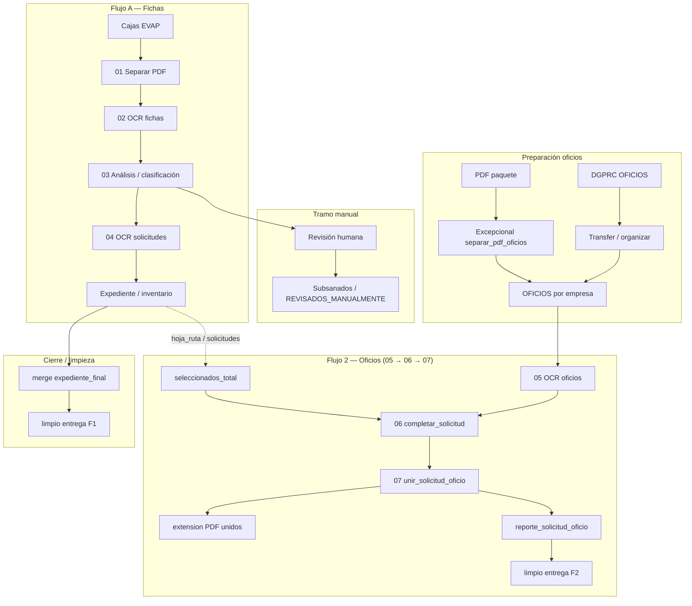
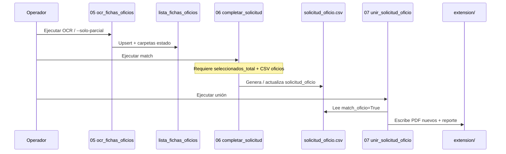
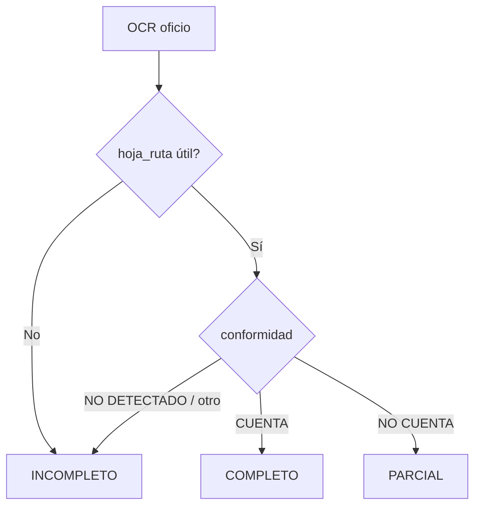

# PROYECTO-IGAS — Documentación funcional de flujos

Documento de **proceso funcional** para evaluación externa del entregable.
Describe el diseño de la solución, datos, repositorios, tipos documentales, scripts ETL, limpieza, roles de acceso, algoritmo de verificación, documentación técnica, diagramas y manual de uso operativo.

**Configuración de rutas:** `config/config_local.yaml` (local) o `config/config_vm.yaml` (VM). No hardcodear absolutas en `src/`.

---

## Índice

1. [Diseño de la solución](#1-diseño-de-la-solución)
2. [Tipos documentales](#2-tipos-documentales)
3. [Análisis de repositorios y carpetas](#3-análisis-de-repositorios-y-carpetas)
4. [Modelo de datos](#4-modelo-de-datos)
5. [Scripts ETL y orquestación](#5-scripts-etl-y-orquestación)
6. [Limpieza y nomenclatura](#6-limpieza-y-nomenclatura)
7. [Algoritmo de verificación](#7-algoritmo-de-verificación)
8. [Roles de acceso](#8-roles-de-acceso)
9. [Diagramas de flujo](#9-diagramas-de-flujo)
10. [Documentación técnica](#10-documentación-técnica)
11. [Manual de usuario (operación)](#11-manual-de-usuario-operación)
---

## 1. Diseño de la solución

### 1.1 Objetivo

Automatizar, con apoyo de OCR (Tesseract), el tratamiento de documentación ambiental/telecomunicaciones MTC ligada a **fichas técnicas EVAP** y **oficios** de respuesta, hasta obtener:

- tablas de control (`hoja_ruta`, clasificación, inventario);
- PDF de expedientes por solicitud;
- PDF **unidos** solicitud + oficio (cuando hay match).

Incluye un tramo de **revisión humana** (clasificación dudosa / corrección manual) y procesos excepcionales: merge a `expediente_final`, limpieza de inventarios de entrega, subsanados.

### 1.2 Arquitectura lógica

Separación por capas (estilo casos de uso + CLI):


| Capa                  | Ubicación                    | Responsabilidad                                                              |
| --------------------- | ---------------------------- | ---------------------------------------------------------------------------- |
| Casos de uso          | `src/application/use_cases/` | Lógica de negocio (`ejecutar(config, logger, ...)`)                          |
| Infraestructura       | `src/infrastructure/`        | OCR, YAML, filesystem, logging, PDF                                          |
| Puntos de entrada CLI | `src/interfaces/cli/`        | Argumentos de consola; orquestan casos de uso                                |
| Utilidades            | `src/utils/`                 | Empresas, oficios (transfer/carpetas), **inventarios** (limpieza compartida) |


Agrupación funcional de casos de uso / CLI:


| Flujo         | Bloque código        | Pasos                 | Qué es                                               |
| ------------- | -------------------- | --------------------- | ---------------------------------------------------- |
| **Flujo 1**   | `flujo_caja_fichas`  | **01 → 02 → 03 → 04** | Cajas → fichas → análisis → solicitudes / expediente |
| **Flujo 2**   | `flujo_caja_oficios` | **05 → 06 → 07**      | Oficios: OCR → **completar** → **unir**              |
| Excepcionales | `excepcionales`      | —                     | Fuera de ambos pipelines                             |


**Flujo 2 empieza en el punto 5** (no reutiliza 01–04 como pasos internos). Sus únicos pasos de proceso son:

```text
05  ocr_fichas_oficios
06  completar_solicitud
07  unir_solicitud_oficio
```

### 1.3 Principios de diseño

- **Acumulativo:** tablas de oficios no se regeneran enteras al procesar una empresa (salvo flags explícitos como `--solo-tabla`).
- **Conservador en 2ª pasada:** no pisar `hoja_ruta` / `revisado` ya editados; solo rellenar o mejorar (p. ej. a `CUENTA`).
- **Orden estricto oficios:** siempre **06 completar_solicitud** *antes* de **07 unir_solicitud_oficio** (el unir consume `solicitud_oficio.csv`).
- **Config externalizada:** rutas, Tesseract e idiomas en YAML.

### 1.4 Estructura de código (resumen)

```text
src/
  application/use_cases/
    flujo_caja_fichas/
    flujo_caja_oficios/
    excepcionales/
  utils/
    empresas/          # normalizar_remitente, carpetas_oficios
    inventarios/       # limpieza compartida (hoja_ruta, asunto, OCR, entrega)
    oficios/           # transferencia / crear_carpetas_empresas
    expedientes_2019/
  infrastructure/
  interfaces/cli/
    flujo_caja_fichas/
    flujo_caja_oficios/
    excepcionales/
```

---

## 2. Tipos documentales


| Tipo                                 | Descripción operativa                                            | Flujo principal                 |
| ------------------------------------ | ---------------------------------------------------------------- | ------------------------------- |
| **Ficha técnica**                    | Documentación de proyecto en cajas EVAP (`02. FICHAS TECNICAS`)  | 01 → 02 → 03                    |
| **Solicitud / informe**              | Piezas asociadas a expediente; OCR de contenido en seleccionados | 03 (clasifica) → 04             |
| **Oficio**                           | Respuesta MTC a la empresa; carpeta `OFICIOS/{empresa}`          | 05 → 06 → 07                    |
| **PDF unido solicitud+oficio**       | Producto de match por `hoja_ruta`                                | 07 → `extension/`               |
| **Material de revisión / subsanado** | Revisión humana o PDF ya corregidos                              | Export revisión / excepcionales |


**Fuera del pipeline 01–07 activo (solo preparado en config):** resoluciones directorales (`paths.input.resoluciones` + work `ocr_resoluciones`) — documentar cuando se active el caso de uso.

Dominio textual frecuente en asunto/revisión: referencias **EVAP**, **hoja de ruta** `E-######-####`, empresas de telecomunicaciones.

---

## 3. Análisis de repositorios y carpetas

### 3.1 Repositorio de código (`OCR_IGAS`)


| Ruta           | Rol                                            |
| -------------- | ---------------------------------------------- |
| `config/`      | YAML de entorno (local/VM/ejemplo)             |
| `data/work/`   | Intermedios (separación, OCR, tablas, oficios) |
| `data/output/` | Resultados finales e inventarios locales       |
| `data/logs/`   | Logs por proceso                               |
| `docs/`        | Esta documentación                             |
| `notebooks/`   | Respaldo histórico (no motor operativo)        |
| `src/`         | Código productivo                              |


### 3.2 Repositorio documental en red (Z:) — según config local

```text
Z:/DOCUMENTACION/Coord. Asuntos Ambientales/
  EVAP-FICHAS TECNICAS/
    02. FICHAS TECNICAS          ← input.cajas
    OFICIOS/{empresa}/           ← input.oficios
      COMPLETO|PARCIAL|INCOMPLETO
    OFICIOS/TELEFONICA_OTROS     ← input.oficio_unido (paquetes)
    extension/                   ← PDF unidos (expedientes_oficio_pdfs)
  RESOLUCIONES DIRECTORALES 2019 ← input.resoluciones (futuro)

Z:/DOCUMENTACION/2019/DGPRC/OFICIOS  ← input.oficios_origen (origen transfer)
```

### 3.3 Work / output locales (D:)


| Clave config                          | Contenido típico                                                    |
| ------------------------------------- | ------------------------------------------------------------------- |
| `work/01_separacion/`                 | PDF separados (fichas y oficios-paquete)                            |
| `work/02_ocr_fichas/`                 | Extracción OCR fichas + reportes                                    |
| `work/03_analisis/tablas`             | `seleccionados`, `revision`, `seleccionados_total`, …               |
| `work/03_analisis/pdfs_clasificados/` | PDF por estado de análisis                                          |
| `work/03_1_revision_manual/`          | PDF en estado `revision` (plano); entrada del reporte de subsanados |
| `work/04_ocr_solicitudes/`            | OCR solicitudes                                                     |
| `work/05_fichas_oficios/reportes`     | `lista_fichas_oficios`, `solicitud_oficio`, validación 06 (`resumen_validacion`, `solicitudes_sin_oficio`, `oficios_sin_solicitud`) |
| `output/04_resultados_finales/`       | Ver mapa de limpieza final (§3.5)                                   |


### 3.4 Carpetas especiales


| Carpeta                                               | Uso                                                                           |
| ----------------------------------------------------- | ----------------------------------------------------------------------------- |
| `sin_clasificar`                                      | Empresa-contenedor de oficios aún no asignados a razón social                 |
| `otros` / `telefonica_otros`                          | Fuera del sync masivo / 2ª pasada salvo decisión explícita                    |
| `paths.work.revision_manual` (`03_1_revision_manual`) | Destino local de PDF analizados a revisión; default del inventario subsanados |
| `REVISADOS_MANUALMENTE` (fuera del repo)              | Archivado operativo externo si se usa                                         |


### 3.5 Output — mapa de `04_resultados_finales/`


| Carpeta                      | Rol en el ETL                                   | Notas                                                                                                                       |
| ---------------------------- | ----------------------------------------------- | --------------------------------------------------------------------------------------------------------------------------- |
| `**expedientes/**`           | Paso **04**                                     | PDF con informe técnico; partición `lote_N/`.                                                                               |
| `**inventario/**`            | Paso **04** (canónico)                          | `inventario_general.csv`, `inventario_final.csv` por `lote_N/`.                                                             |
| `**expediente_final/**`      | Merge post-lotes (`run_merge_expediente_final`) | Consolida lotes → `pdfs/` + inventario acumulado. Path YAML; **sin** sufijo `lote_`*.                                       |
| `**expedientes_oficio/**`    | Paso **07** + limpieza entrega                  | `reporte_solicitud_oficio.csv` (operativo) y `reporte_solicitud_oficio_limpio.csv` (entrega). PDF unidos en Z:`extension/`. |
| `**expediente_subsanados/**` | Excepcional / opcional                          | PDF corregidos; inventario también desde `work/03_1_revision_manual`.                                                       |


La carpeta `resultados/` **no forma parte del proceso** (retirada del YAML). La revisión humana usa `work/03_1_revision_manual`.

### 3.6 Cadena de cierre (después de lotes / Flujo 2)

```text
Flujo 1 (lotes) ──► expediente_final/          (merge)
                 └──► inventario limpio entrega  (limpiar --tipo expediente_final)

Flujo 2 (05→06→07) ──► extension/ + reporte_solicitud_oficio.csv
                    └──► reporte_solicitud_oficio_limpio.csv  (limpiar --tipo oficios)
```

---

## 4. Modelo de datos

### 4.1 Entidades conceptuales

```text
Caja / Carpeta / PDF origen
        │
        ▼
Documento_separado (archivo_pdf, páginas)
        │
        ▼
Registro_ficha (hoja_ruta, remitente, n_doc, asunto, folios, …)
        │
        ├──► Clasificación_analisis (seleccionado | revision | …)
        │         │
        │         ▼
        │    Registro_solicitud / inventario_final
        │
Oficio_PDF (empresa, archivo)
        │
        ▼
Registro_oficio (hoja_ruta, conformidad, tiene_hoja_ruta, revisado)
        │
        ▼  (match por hoja_ruta — paso 06)
solicitud_oficio (match_oficio, …)
        │
        ▼  (paso 07)
PDF_unido + reporte_solicitud_oficio
```

### 4.2 Tablas / archivos clave


| Artefacto                                 | Ubicación típica                     | Campos principales                                                                                                                |
| ----------------------------------------- | ------------------------------------ | --------------------------------------------------------------------------------------------------------------------------------- |
| Extracción OCR fichas                     | work 02                              | `caja,carpeta,pdf_origen,archivo_pdf,hoja_ruta,folios,remitente,n_doc,asunto,…`                                                   |
| `seleccionados.csv` / `revision.csv` / …  | work 03 tablas                       | `hoja_ruta,…,estado,motivo`                                                                                                       |
| `seleccionados_total` (.xlsx)             | work 03 tablas                       | Hojas `SELECCIONADOS` / `EMPRESAS` — **entrada del paso 06**; se genera con **03b** (`run_03b_consolidar_seleccionados_total.py`) |
| `inventario_final.csv`                    | output inventario                    | `hoja_ruta,nombre_informe,tiene_informe,…`                                                                                        |
| `lista_fichas_oficios`                    | work 05 + por empresa                | `empresa;archivo;hoja_ruta;conformidad;tiene_hoja_ruta;revisado` (+ `ruta_pdf` operativo)                                         |
| `solicitud_oficio.csv`                    | work 05                              | Merge solicitudes×oficios + `match_oficio`                                                                                        |
| `resumen_validacion.csv`                  | work 05                              | Validación 06: `metrica,valor` (encontrados vs no encontrados en ambos sentidos)                                                  |
| `solicitudes_sin_oficio.csv`              | work 05                              | Validación 06: solicitudes sin oficio (`match_oficio=False`)                                                                      |
| `oficios_sin_solicitud.csv`               | work 05                              | Validación 06: oficios elegibles sin solicitud asociada                                                                           |
| `reporte_solicitud_oficio.csv`            | expedientes_oficio                   | Operativo 07: `hoja_ruta,archivo_solicitud,archivo_oficio,pdf_salida,paginas_*,match_oficio,…`                                    |
| `**reporte_solicitud_oficio_limpio.csv**` | expedientes_oficio                   | **Entrega Flujo 2:** `hoja_ruta`, `oficio`, `remitente`, `asunto` (§4.4)                                                          |
| Inventario alimentado limpio (F1)         | expediente_final                     | **Entrega Flujo 1:** `hoja_ruta`, `nombre_informe`, `remitente`, `asunto`                                                         |
| Inventario subsanados                     | excepcional (`03_1_revision_manual`) | `hoja_ruta;nombre_informe;remitente;asunto`                                                                                       |


### 4.3 Claves de emparejamiento

- **Primaria de negocio:** `hoja_ruta` (expediente, p. ej. `E-309739-2019`).
- **Oficio en disco ↔ fila:** `(empresa, archivo)` con tolerancia a espacios múltiples en el nombre de archivo.
- **Exclusión en merge 06:** oficios con `revisado=visto` o estado `PARCIAL` / `INCOMPLETO` no entran al match (solo elegibles tipo COMPLETO / reglas del filtro).

### 4.4 Esquema de entrega final (limpieza)

Fuente única de reglas: `utils/inventarios/limpieza.py`. Orquestación: `excepcionales/limpiar_resultado_final`.


| Flujo              | Archivo de entrega                                        | Columnas                                                                           |
| ------------------ | --------------------------------------------------------- | ---------------------------------------------------------------------------------- |
| **1 — Expediente** | `expediente_final/inventario_final_alimentado_limpio.csv` | `hoja_ruta`, `**nombre_informe`** (n_doc / informe técnico), `remitente`, `asunto` |
| **2 — Oficios**    | `expedientes_oficio/reporte_solicitud_oficio_limpio.csv`  | `hoja_ruta`, **`oficio`** (código corto, p. ej. `Oficio 0576 2019 MTC 26`), `remitente`, `asunto` |


Reglas comunes:

1. Enriquecer con `reporte_total.json` (OCR fichas) por `hoja_ruta`.
2. Excluir filas con `remitente` vacío (tras merge).
3. Deduplicar por `hoja_ruta`.
4. Limpiar `asunto` dejando el texto **desde la palabra `proyecto`**.

Específico Flujo 2:

- `oficio` ← `archivo_oficio` recortado hasta el código MTC (sin razón social ni `.pdf`).
  Ej.: `Oficio 0576 2019 MTC 26 MEDIA COMMERCE PERÚ SAC.pdf` → `Oficio 0576 2019 MTC 26`.
- `remitente` ← el más completo entre `remitente` (solicitud/OCR) y `empresa` (carpeta OFICIOS).
- Solo filas con `match_oficio=True`.

---

## 5. Scripts ETL y orquestación

Tratamiento tipo **ETL** sobre documentos y tablas (Extraer → Transformar/OCR → Cargar tablas/PDF).

### 5.1 Flujo 1 — Fichas (pasos 01–04)


| Orden | Punto de entrada CLI        | Caso de uso       | Función ETL                                            |
| ----- | --------------------------- | ----------------- | ------------------------------------------------------ |
| 01    | `run_01_separar_pdf.py`     | `separar_pdf`     | E: cajas → T: cortes PDF → L: `separados`              |
| 02    | `run_02_ocr_fichas.py`      | `ocr_fichas`      | E: PDF → T: OCR fichas → L: reportes/extracción        |
| 03    | `run_03_analisis_datos.py`  | `analizar_datos`  | E: tablas OCR → T: reglas → L: CSV + PDF clasificados  |
| 04    | `run_04_ocr_solicitudes.py` | `ocr_solicitudes` | E: seleccionados → T: OCR → L: inventarios/expedientes |


Orquestador: `cli/flujo_caja_fichas/run_pipeline.py`.

### 5.1b Tras Flujo 1 — consolidación y carpetas OFICIOS


| CLI                                                           | Rol                                                                                          |
| ------------------------------------------------------------- | -------------------------------------------------------------------------------------------- |
| `flujo_caja_fichas/run_03b_consolidar_seleccionados_total.py` | Une `lote_*/seleccionados.csv` + OCR → `seleccionados_total.xlsx` (SELECCIONADOS + EMPRESAS) |
| `utils/oficios/run_crear_carpetas_empresas.py`                | Crea `OFICIOS/{empresa}/{COMPLETO|PARCIAL|INCOMPLETO}` desde pestaña **EMPRESAS**            |


```bash
python src/interfaces/cli/flujo_caja_fichas/run_03b_consolidar_seleccionados_total.py --config config/config_local.yaml
python src/utils/oficios/run_crear_carpetas_empresas.py --config config/config_local.yaml
```

---

### 5.2 Flujo 2 — Oficios (solo pasos 05, 06 y 07)

El **Flujo 2** es independiente del 1 en cuanto a ejecución: **parte del punto 5**.
No incluye separación de cajas ni OCR de fichas; trabaja sobre `OFICIOS/{empresa}` y tablas ya disponibles (`seleccionados_total`, etc.).

```text
┌─────────────────────────────────────────────────────────────┐
│  FLUJO 2                                                    │
│                                                             │
│   05 OCR oficios  →  06 completar_solicitud  →  07 unir    │
│         │                      │                     │      │
│         ▼                      ▼                     ▼      │
│  lista_fichas_oficios   solicitud_oficio.csv    extension/  │
└─────────────────────────────────────────────────────────────┘
```

> **Orden obligatorio:** **06** siempre **antes** de **07**. El paso 07 lee `solicitud_oficio.csv` que genera el 06.

Orquestador (05→06→07):
`cli/flujo_caja_oficios/run_pipeline_oficios.py`

#### Paso 05 — `ocr_fichas_oficios`


|                    |                                                                                                                                |
| ------------------ | ------------------------------------------------------------------------------------------------------------------------------ |
| **CLI**            | `run_05_ocr_fichas_oficios.py`                                                                                                 |
| **Entrada**        | PDF en `paths.input.oficios` / `{empresa}/` (y, con flags, PARCIAL                                                             |
| **Transformación** | OCR referencia (`hoja_ruta`) + conformidad; clasifica COMPLETO                                                                 |
| **Salida**         | `lista_fichas_oficios.csv` (general + por empresa); mueve PDF a subcarpetas de estado                                          |
| **Flags útiles**   | `--empresa`, `--excluir` (lista coma), `--solo-parcial` (2ª pasada), `--solo-tabla`, `--sin-clasificar`, `--sincronizar-disco` |


#### Paso 06 — `completar_solicitud` *(antes que 07)*


|                    |                                                                                    |
| ------------------ | ---------------------------------------------------------------------------------- |
| **CLI**            | `run_06_completar_solicitud.py`                                                    |
| **Entrada**        | `seleccionados_total` (work 03) + `lista_fichas_oficios` (work 05)                 |
| **Transformación** | Join por `hoja_ruta`; excluye oficios `revisado=visto` o estado PARCIAL/INCOMPLETO |
| **Salida**         | `solicitud_oficio.csv` (`match_oficio`, datos de solicitud y oficio)               |
| **Validación**     | `resumen_validacion.csv` + `solicitudes_sin_oficio.csv` + `oficios_sin_solicitud.csv` (ver §7.3) |


Sin este paso, el 07 no tiene tabla de matches actualizada.

**Reportes de validación (paso 06).** Como se evalúan los **dos contenidos** (solicitudes y oficios), el paso deja en `work/05_fichas_oficios/reportes/` una evaluación cruzada que demuestra *lo encontrado* y *lo no encontrado*, **sin modificar** el inventario final:

- `resumen_validacion.csv` — tabla `metrica, valor` con el panorama: totales, con match y sin match en ambos sentidos.
- `solicitudes_sin_oficio.csv` — solicitudes cuyo oficio **no** se encontró (`match_oficio = False`).
- `oficios_sin_solicitud.csv` — oficios elegibles cuya `hoja_ruta` **no** aparece en ninguna solicitud.

> `oficios_sin_solicitud` se calcula sobre oficios **elegibles** (COMPLETO con `hoja_ruta`; se excluyen `revisado=visto` y PARCIAL/INCOMPLETO, que no tienen `hoja_ruta` confiable para emparejar).

#### Paso 07 — `unir_solicitud_oficio` *(después de 06)*


|                    |                                                                                  |
| ------------------ | -------------------------------------------------------------------------------- |
| **CLI**            | `run_07_unir_solicitud_oficio.py`                                                |
| **Entrada**        | `solicitud_oficio.csv` + PDF solicitud + PDF oficio                              |
| **Transformación** | Une páginas; no modifica PDF de origen                                           |
| **Salida**         | PDF en `expedientes_oficio_pdfs` (`extension/`) + `reporte_solicitud_oficio.csv` |
| **Flags**          | `--forzar` para regenerar unidos ya existentes                                   |


#### Preparación previa al Flujo 2 (no son pasos 05–07)


| Utilidad                                | Rol                                                               |
| --------------------------------------- | ----------------------------------------------------------------- |
| Transfer DGPRC → EVAP/OFICIOS           | Dejar PDF en carpetas de empresa                                  |
| `run_separar_pdf_oficios` (excepcional) | Desempaquetar PDF multi-oficio                                    |
| Contar con `seleccionados_total`        | Precondición del **06** (viene del mundo Flujo 1 / consolidación) |


#### Comandos Flujo 2

```bash
# Todo el Flujo 2 por empresa (05 → 06 → 07)
python src/interfaces/cli/flujo_caja_oficios/run_pipeline_oficios.py --config config/config_local.yaml --empresa "BANTEL S.A.C"

# Solo 05 (p. ej. 2ª pasada PARCIAL+INCOMPLETO)
python src/interfaces/cli/flujo_caja_oficios/run_05_ocr_fichas_oficios.py --config config/config_local.yaml --solo-parcial --empresa "sin_clasificar"

# 2ª pasada masiva omitiendo empresas ya tratadas
python src/interfaces/cli/flujo_caja_oficios/run_05_ocr_fichas_oficios.py --config config/config_local.yaml --solo-parcial --excluir "sin_clasificar,AMERICA MOVIL,TELEFONICA DEL PERU S.A.A,otros"

# Solo 06 — match (obligatorio antes de 07)
python src/interfaces/cli/flujo_caja_oficios/run_06_completar_solicitud.py --config config/config_local.yaml

# Solo 07 — unión PDF (después de 06)
python src/interfaces/cli/flujo_caja_oficios/run_07_unir_solicitud_oficio.py --config config/config_local.yaml
```

### 5.3 Excepcionales (fuera de Flujo 1 y Flujo 2)


| CLI                                     | Rol                                                                                |
| --------------------------------------- | ---------------------------------------------------------------------------------- |
| `run_export_review.py`                  | Exporta lote a revisión (`revision_manual` o `revision_expedientes`)               |
| `run_merge_expediente_final.py`         | Consolida lotes → `expediente_final/` (PDF + inventario)                           |
| `run_limpiar_resultado_final.py`        | Inventarios de **entrega** (§4.4): `--tipo oficios` | `expediente_final` | `ambos` |
| `run_reporte_expedientes_subsanados.py` | Inventario PDF en `03_1_revision_manual`                                           |
| `run_merge_ocr_fichas_json.py`          | Consolidar JSON OCR fichas                                                         |
| `run_separar_pdf_oficios.py`            | Prep: PDF paquete → sueltos                                                        |


### 5.3b Cierre / limpieza de resultado final

Tras consolidar lotes (F1) o unir oficios (F2):

```bash
# Merge lotes → expediente_final/
python src/interfaces/cli/excepcionales/run_merge_expediente_final.py --config config/config_local.yaml --desde 1 --hasta 31

# Entrega Flujo 2 (hoja_ruta, oficio, remitente, asunto)
python src/interfaces/cli/excepcionales/run_limpiar_resultado_final.py --config config/config_local.yaml --tipo oficios

# Entrega Flujo 1 (hoja_ruta, nombre_informe, remitente, asunto)
python src/interfaces/cli/excepcionales/run_limpiar_resultado_final.py --config config/config_local.yaml --tipo expediente_final
```

No duplicar reglas de limpieza en CLI ni notebooks: usar `utils/inventarios/limpieza.py`.

### 5.3c Inventario unificado de lote (`inventario_lote_2.xlsx`)

Une las 3 tablas limpieas → Excel en `04_resultados_finales/inventario_lote_2.xlsx`:

- `inventario_final_alimentado_limpio` → `informe`
- `inventario_subsanados` → `informe`
- `reporte_solicitud_oficio_limpio` → `oficio` (código corto vía `limpiar_nombre_oficio`)

Columnas: `hoja_ruta`, `oficio`, `informe`, `tipo_IGA` (= Ficha), `NOMBRE DEL PROYECTO`, `proyecto_url` (vacío), `administrador`, `estado` (= conforme).

```bash
python src/interfaces/cli/excepcionales/run_consolidar_inventario_lote.py --config config/config_local.yaml
```

### 5.4 Comando Flujo 1 (referencia)

```bash
python src/interfaces/cli/flujo_caja_fichas/run_pipeline.py --config config/config_local.yaml
```

---

## 6. Limpieza y nomenclatura

### 6.1 Nombres de archivo de oficio

- Conservar **nombre literal** del PDF en campo `archivo` (no colapsar espacios al guardar).
- Matching interno tolera espacios múltiples.
- Variantes OCR / acentos en el nombre (`AMÉRICA` / `AMERICA`, `BANDTEL` / `BANTEL`) se gestionan vía utilidades de empresa y carpetas destino; no renombrar masivamente en la 2ª pasada conservadora.

### 6.2 Remitente / empresa

- Catálogo canónico en `utils/empresas/normalizar_remitente.py` (correcciones OCR frecuentes, forma jurídica S.A.C., etc.).
- Destino físico: subcarpeta bajo `OFICIOS/{empresa}/`.

### 6.3 `hoja_ruta`

- Forma esperada: `E-<número>-<año>` (p. ej. `E-082118-2019`).
- Validación operativa: no vacía, longitud acotada, no contiene el literal engañoso `REFERENCIA`.
- 2ª pasada: zona OCR ampliada cuando el ASUNTO es multilínea.

### 6.4 Tablas editadas a mano

- Tras edición de `lista_fichas_oficios.csv`, preferir `--solo-parcial` / merge conservador.
- Evitar `--solo-tabla` si se deben preservar correcciones masivas (regenera por empresa).

### 6.5 Separador CSV

- El cargador detecta `;` vs `,`; al guardar se preserva el separador existente cuando el archivo ya existe (compatibilismo Excel regional).

### 6.6 Inventarios de entrega (sin columnas operativas)

Los CSV “limpios” de cierre **no** llevan rutas de red, páginas ni flags internos. Solo columnas de negocio (§4.4).


| Flujo | Campo documento  | Significado                                      |
| ----- | ---------------- | ------------------------------------------------ |
| 1     | `nombre_informe` | Texto del informe técnico (OCR fichas / paso 04) |
| 2     | `oficio`         | Código del oficio (`Oficio NNNN AAAA MTC NN`), sin empresa |


---

## 7. Algoritmo de verificación

### 7.1 Análisis de fichas (paso 03)

Clasifica PDF en:

- `seleccionados` / `revision` / `no_seleccionados` / `no_considerados`

según reglas de negocio del caso de uso `analizar_datos` (folios, palabras clave EVAP/IGA, calidad OCR, etc.).
Salida: tablas + copia/movimiento a carpetas `pdfs_clasificados/...`.

### 7.2 Verificación de oficios (paso 05)

**Entrada OCR (páginas 1 y, en 2ª pasada, 2):**

1. Extraer código de **REFERENCIA / Hoja de ruta** (zona base; si falla → zona larga).
2. Extraer **conformidad**:
  - zona corta; si no es concluyente → párrafo de cuerpo (*“cuenta con la información técnica…”* / *“no cuenta…”*).
3. Clasificar estado y opcionalmente **mover** el PDF:


| Estado `tiene_hoja_ruta` | Condición                                      |
| ------------------------ | ---------------------------------------------- |
| **COMPLETO**             | `hoja_ruta` útil **y** conformidad `CUENTA`    |
| **PARCIAL**              | `hoja_ruta` útil **y** conformidad `NO CUENTA` |
| **INCOMPLETO**           | resto (sin hoja útil, `NO DETECTADO`, etc.)    |


### 7.3 Verificación de match (paso 06)

- Une solicitudes (`seleccionados_total`) con oficios elegibles por `hoja_ruta`.
- Excluye oficios marcados `revisado=visto` o en estados no elegibles (`PARCIAL`, `INCOMPLETO`).
- Produce columna `match_oficio` (booleana / indicador de éxito).
- **Evaluación de los 2 contenidos** (reportes aparte, no tocan el inventario final):
  - `resumen_validacion.csv` — tabla `metrica, valor` con encontrados vs no encontrados en ambos sentidos.
  - `solicitudes_sin_oficio.csv` — solicitudes sin oficio (`match_oficio = False`).
  - `oficios_sin_solicitud.csv` — oficios elegibles sin solicitud asociada.

### 7.4 Verificación de unión (paso 07)

- Solo filas con match válido.
- Genera PDF nuevo (no altera orígenes).
- Registra páginas y ruta de salida; omite si ya existe (salvo `--forzar`).

### 7.5 2ª pasada (`--solo-parcial`)

- Scope: carpetas **PARCIAL** e **INCOMPLETO**.
- Merge fila a fila: no pisar datos útiles previos; puede **mejorar** a `CUENTA` y reclasificar/mover.
- `--excluir`: omite carpetas de empresa (p. ej. ya procesadas: `sin_clasificar`, majors, `otros`).

### 7.6 Verificación de inventario de entrega (`limpiar_resultado_final`)

- OCR fichas alimenta `remitente` / `asunto` (y `nombre_informe` en F1).
- Filtro remitente no vacío + dedupe `hoja_ruta` + asunto desde `proyecto`.
- F2: `oficio` = código corto del archivo (sin empresa); `remitente` prioriza el texto más completo frente a `empresa`.

---

## 8. Roles de acceso

El software **no implementa** autenticación de usuarios ni RBAC interno. El control es **organizacional + sistema de archivos**.


| Rol sugerido (operativo)    | Acciones típicas                                          | Requisito de acceso                                                                 |
| --------------------------- | --------------------------------------------------------- | ----------------------------------------------------------------------------------- |
| **Operador OCR / pipeline** | Ejecutar CLI 01–07, leer work/logs                        | Ejecución Python + Tesseract; lectura/escritura `data/` y rutas Z: de oficios/cajas |
| **Analista de calidad**     | Editar `lista_fichas_oficios`, revisar PARCIAL/INCOMPLETO | Escritura CSV reportes; lectura PDF en `OFICIOS`                                    |
| **Revisor documental**      | Revisar `03_1_revision_manual` / exports                  | Lectura (y a veces escritura) carpetas de revisión                                  |
| **Administrador de rutas**  | Mantener YAML, inventarios transfer                       | Escalada en `config/` y permisos de red Z:                                          |
| **Solo lectura auditoría**  | Consultar inventarios y `extension/`                      | Lectura output + extension                                                          |


**Recomendación de política:** cuentas de servicio o perfil con acceso acotado a
`EVAP-FICHAS TECNICAS\OFICIOS`, `extension`, `02. FICHAS TECNICAS`; sin borrado masivo en producción.

---

## 9. Diagramas de flujo

### 9.1 Vista global




### 9.2 Secuencia estricta oficios




### 9.3 Decisión de clasificación de oficio




---

## 10. Documentación técnica

### 10.1 Dependencias de ejecución

- Python 3.x con dependencias del proyecto (`pandas`, `PyMuPDF`/`fitz`, `pytesseract`, `Pillow`, OpenCV opcional).
- **Tesseract OCR** instalado; idiomas `spa+eng` recomendados (`ocr.languages`).
- Acceso de red a volúmenes Z: definidos en YAML.

### 10.2 Configuración relevante

```yaml
ocr:
  tesseract_cmd: ...
  languages: spa+eng
paths:
  input: { cajas, oficios, oficios_origen, oficio_unido, resoluciones }
  work:  { separacion, ocr_fichas, analisis, revision_manual, ocr_solicitudes, fichas_oficios, ... }
  output.resultados_finales:
    expedientes, inventario, expediente_final,
    expedientes_oficio, expedientes_oficio_pdfs,
    expediente_subsanados
    # (sin clave resultados — legacy retirado)
  logs: ...
```

Cierre (merge + limpio): ver **§5.3b**.

### 10.3 Flags útiles (oficios)


| Flag                  | Efecto                                             |
| --------------------- | -------------------------------------------------- |
| `--empresa`           | Filtra carpeta de empresa                          |
| `--excluir`           | Omite empresas (lista separada por comas)          |
| `--solo-parcial`      | 2ª pasada PARCIAL+INCOMPLETO, merge conservador    |
| `--solo-tabla`        | Relee también clasificados; regenera tabla empresa |
| `--sin-clasificar`    | OCR sin mover PDF de carpeta                       |
| `--sincronizar-disco` | Alinea CSV con carpetas reales (sin OCR)           |
| `--forzar` (07)       | Regenera PDF unidos existentes                     |
| `--tipo` (limpiar)    | `oficios` | `expediente_final` | `ambos`           |


### 10.4 Logs

Cada ejecución escribe bajo `paths.logs` con prefijo del proceso (`05_ocr_fichas_oficios_…`, `pipeline_oficios_…`, etc.).

### 10.5 Pruebas de humo sugeridas

1. `--help` de CLI 05/06/07.
2. `--solo-parcial --empresa` de muestra pequeña (p. ej. BANTEL).
3. Verificar que 06 genera `solicitud_oficio.csv` antes de 07.
4. Comprobar un `hoja_ruta` conocido aparece en `extension/` tras 07.

---

## 11. Manual de usuario (operación)

### 11.1 Antes de empezar

1. Activar entorno Python del proyecto.
2. Verificar `config/config_local.yaml` (rutas Z: y `tesseract_cmd`).
3. `tesseract --list-langs` incluye `spa` (y `eng`).
4. Cerrar Excel si tiene abierto `lista_fichas_oficios.csv` (bloqueo de escritura).

### 11.2 Correr Flujo 1 — Fichas (01–04)

```bash
python src/interfaces/cli/flujo_caja_fichas/run_pipeline.py --config config/config_local.yaml
```

Opcional por lotes: `--lote N --tamano-lote 5`.
Tras errores de calidad: exportar revisión (`excepcionales/run_export_review.py`) y completar tramo manual.

### 11.3 Preparar oficios

1. Asegurar PDF en `OFICIOS/{empresa}/` (transfer / reubicación).
2. Si hay paquetes: excepcional `run_separar_pdf_oficios.py` y colocar salidas en la empresa.

### 11.4 Correr Flujo 2 — Oficios (pasos 05, 06 y 07)

El Flujo 2 **parte del punto 5**. Secuencia fija:

1. **05** OCR / clasificación de oficios (`run_05_…` o dentro del pipeline).
2. Confirmar `seleccionados_total` (dato de solicitudes).
3. **06** `run_06_completar_solicitud.py` → `solicitud_oficio.csv`.
4. **07** `run_07_unir_solicitud_oficio.py` → PDF en `extension/`.

**Opción completa (05→06→07 por empresa):**

```bash
python src/interfaces/cli/flujo_caja_oficios/run_pipeline_oficios.py --config config/config_local.yaml --empresa "NOMBRE EMPRESA"
```

### 11.5 Re-trabajo de calidad (2ª pasada)

```bash
# Una empresa
python src/interfaces/cli/flujo_caja_oficios/run_05_ocr_fichas_oficios.py --config config/config_local.yaml --solo-parcial --empresa "sin_clasificar"

# Varias, omitiendo ya procesadas
python src/interfaces/cli/flujo_caja_oficios/run_05_ocr_fichas_oficios.py --config config/config_local.yaml --solo-parcial --excluir "sin_clasificar,AMERICA MOVIL,TELEFONICA DEL PERU S.A.A,ENTEL PERU S.A,otros"
```

Luego, si hay nuevos COMPLETO, repetir **06** y **07** para incorporar matches/uniones nuevas.

### 11.6 Cierre — inventarios de entrega

```bash
# Tras lotes Flujo 1
python src/interfaces/cli/excepcionales/run_merge_expediente_final.py --config config/config_local.yaml --desde 1 --hasta 31
python src/interfaces/cli/excepcionales/run_limpiar_resultado_final.py --config config/config_local.yaml --tipo expediente_final

# Tras Flujo 2 (uniones)
python src/interfaces/cli/excepcionales/run_limpiar_resultado_final.py --config config/config_local.yaml --tipo oficios
```

Comprobar columnas: F1 → `nombre_informe`; F2 → `oficio` (nombre de archivo).

### 11.7 Qué revisar si “falla”


| Síntoma                           | Revisar                                                                     |
| --------------------------------- | --------------------------------------------------------------------------- |
| `ModuleNotFoundError`             | Ejecutar desde raíz del repo; CLI bajo `interfaces/cli/...`                 |
| 0 filas actualizadas en 2ª pasada | CSV con NaN históricos (ya mitigado); o sin dato nuevo real                 |
| Match bajo en 06                  | Oficios aún PARCIAL/INCOMPLETO; o `seleccionados_total` desactualizado      |
| 07 sin PDF nuevos                 | Ejecutar 06 antes; `match_oficio`; o destino ya existente sin `--forzar`    |
| Conformidad mal etiquetada        | Documentos con frase en cuerpo: exige pasada con detector de cuerpo vigente |
| Limpio sin filas / columnas raras | Entrada sin match; o tipo incorrecto (`oficios` vs `expediente_final`)      |


---

*Documento del proceso funcional IGAS. Orden oficios: **06** → **07**. Cierre entrega: **limpiar_resultado_final** (§4.4).*